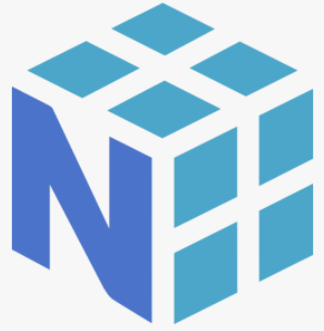
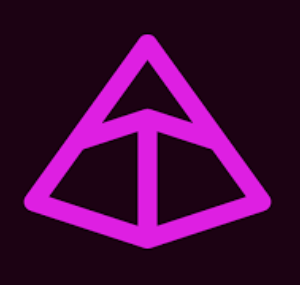
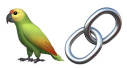
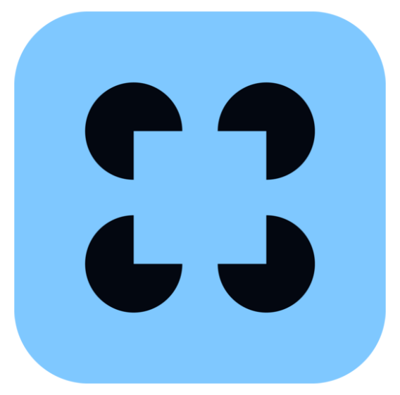
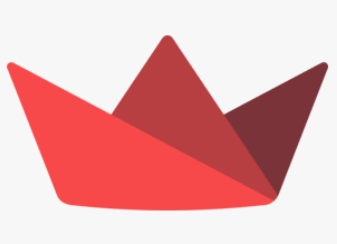
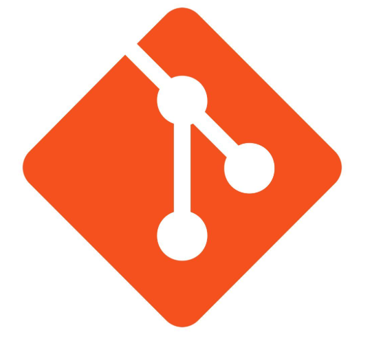
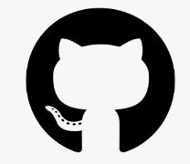
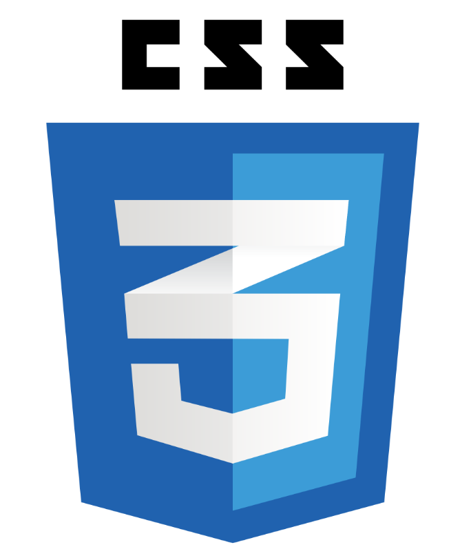

<div align="center">


<a href="https://github.com/Sohith-Pothula">


</a>


<a href="https://git.io/typing-svg">


</a>

<!-- ============================================================ -->
<!-- SOCIAL LINKS                                                  -->
<!-- ============================================================ -->

<div align="center">

<p>
  <a href="https://www.linkedin.com/in/sohith-pothula/"></a>
  <a href="https://x.com/sohith_pothula"></a>
  <a href="https://www.kaggle.com/sohithpothula"></a>
  <a href="https://leetcode.com/u/sohith_pothula/"></a>
  <a href="mailto:sohithpothual@gmail.com"></a>
</p>

</div>

<!-- ============================================================ -->
<!-- SEPARATOR                                                     -->
<!-- ============================================================ -->

<div align="center">


</div>

<!-- ============================================================ -->
<!-- PROFILE                                                       -->
<!-- ============================================================ -->

<div align="left">

<h2>🧠 <code>profile.describe()</code></h2>


```python
model = {
    "name": "Sohith Pothula",

    "type": "Data Science & AI Enthusiast",

    "features": [
        "Data Science",
        "Machine Learning",
        "Deep Learning",
        "Generative AI",
        "RAG",
        "AI Agents"
    ],

    "training_on": [
        "Python",
        "SQL",
        "Statistics",
        "Machine Learning",
        "Deep Learning",
        "LLMs"
    ],

    "currently_building": [
        "ML Projects",
        "RAG Pipelines",
        "AI Agents"
    ],

    "optimization_target":
        "Real-world problem solving",

    "loss_function":
        "Not building enough",

    "learning_rate":
        "∞",

    "runtime":
        "Night Owl Mode",

    "dependencies": [
        "☕ Coffee",
        "Curiosity",
        "Consistency"
    ]
}
</div>
```
<!-- ============================================================ --> <!-- TECH STACK --> <!-- ============================================================ --> <b
<div align="center">


</div>

<br>

<h2 align="center">🔧 <code>model.build("stack")</code></h2>

<h3 align="center">📊 Data Science · ML & DL</h3>

<p align="center">
  
  
  
  
  
</p>

<h3 align="center">🧠 GenAI · Agentic AI</h3>

<p align="center">
  
  
  
  
</p>

<h3 align="center">🚀 Backend · Deployment</h3>

<p align="center">
  
  
  
  
  
</p>

<h3 align="center">🛠️ Developer Tools</h3>

<p align="center">
  
  
  
  
  
  
  
  
</p> <!-- ============================================================ --> <!-- GITHUB CONTRIBUTION STREAK --> <!-- ============================================================ --> 
<br> 
<div align="center">


</div> 
<br> 
<h2 align="center">🔥 <code>streak.monitor()</code></h2> <p align="center">


</p> <!-- ============================================================ --> <!-- CONTRIBUTION GALAGA --> <!-- ============================================================ --> <br> <div align="center">


</div> <br> <h2 align="center">🚀 <code>contribution.galaga()</code></h2> <p align="center">


</p> ```